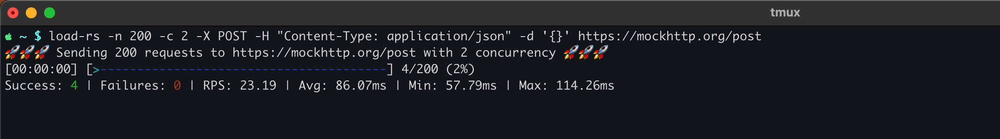

# load-rs

[](https://opensource.org/licenses/Apache-2.0)
[](https://github.com/fredyw/load-rs/actions/workflows/load-rs.yml)

A simple load testing tool written in Rust.



## Table of Contents

- [Usage](#usage)
  - [Command Line Options](#command-line-options)
  - [Output Files](#output-files)
  - [Request Manifest](#request-manifest)
  - [Order](#order)
  - [TLS](#tls)
  - [Statistics](#statistics)
  - [Debugging](#debugging)
  - [Examples](#examples)
- [Building](#building)
- [Installing](#installing)
- [Testing](#testing)
- [Contributing](#contributing)
- [License](#license)

### Usage

#### Command Line Options

```
Usage: load-rs [OPTIONS] --requests <REQUESTS> --concurrency <CONCURRENCY> <URL>

Arguments:
  <URL>  Target URL to send requests to

Options:
  -n, --requests <REQUESTS>            Total number of requests to send
  -c, --concurrency <CONCURRENCY>      Number of concurrent requests to run at a time
  -X, --method <METHOD>                HTTP method to use for the requests [default: get]
  -H, --header <HEADER>                Custom HTTP header(s) in "key: value" format. Can be repeated
  -d, --data <DATA>                    Request body as a string
  -D, --data-file <DATA_FILE>          File to read the request body from
  -i, --data-dir <DATA_DIR>            Directory of files to use as request bodies
  -m, --manifest-file <MANIFEST_FILE>  Request manifest file (JSON Lines format)
  -C, --cacert <CA_CERT>               Custom CA certificate file (PEM format)
  -E, --cert <CERT>                    Public certificate file (PEM format)
  -k, --key <KEY>                      Private key file (PEM format)
  -I, --insecure <INSECURE>            Allows insecure connections by skipping TLS certificate verification [possible values: true, false]
  -O, --order <ORDER>                  Order to process files from --data-dir or --manifest-file [default: sequential]
  -o, --output-dir <OUTPUT_DIR>        Directory to save responses to
  -G, --debug                          Performs a single request and dumps the response
  -s, --stats <STATS>                  Specifies which requests to include in the statistics [default: success]
  -h, --help                           Print help
  -V, --version                        Print version
```

#### Output Files

When the `-o` or `--output-dir` option is specified, `load-rs` will save the response of each request
to a file in the specified directory.

The output file is a JSON object with the following fields:

- `version`: The HTTP version of the response.
- `status`: The HTTP status code of the response.
- `headers`: A map of the response headers.
- `body`: The response body as a string. If the body is not valid UTF-8, it will be base64-encoded.
- `duration`: The duration of the request.
- `error`: The error message if the request failed.

#### Request Manifest

The manifest file is a [JSON Lines](https://jsonlines.org/) file where each line is a JSON object
that defines a request. The following fields are supported:

- `headers`: A map of HTTP headers to be sent with the request.
- `body`: The request body as a string.
- `binary_body`: The request body as a base64-encoded string.

**Note:** If both `body` and `binary_body` are specified, `body` will be used.

**Example `manifest.jsonl`**

```json
{"headers": {"Content-Type": "application/json"}, "body": "{\"key\": \"value1\"}"}
{"headers": {"Content-Type": "application/json"}, "body": "{\"key\": \"value2\"}"}
{"headers": {"Content-Type": "application/octet-stream"}, "binary_body": "SGVsbG8gd29ybGQ="}
```

#### Order

The `-O` or `--order` option allows you to control the order in which requests are sent when using
either the `--data-dir` or `--manifest-file` option. The following values are supported:

- `sequential` (default): Requests are sent in the order they appear in the directory or manifest file.
- `random`: Requests are sent in a random order.

#### TLS

`load-rs` supports several options for configuring TLS:

- `-C, --cacert <CA_CERT>`: Use a custom CA certificate file (PEM format) to verify the server's certificate.
- `-E, --cert <CERT>`: Use a client certificate file (PEM format) for mutual TLS authentication.
- `-k, --key <KEY>`: Use a private key file (PEM format) for the client certificate.
- `-I, --insecure`: Allows insecure connections by skipping TLS certificate verification.

#### Statistics

The `s` or `--stats` option allows you to control which requests are included in the statistics. The following
values are supported:

- `success` (default): Only include successful requests in the statistics.
- `error`: Only include failed requests in the statistics.
- `all`: Include all requests (successful and failed) in the statistics.

#### Debugging

The `-G` or `--debug` option can be used to perform a single request and dump the response to the console.
This is useful for verifying that your requests are correct and that the server is responding as expected.
When using this option, the `-n`, `-c`, and `-o` options are ignored.

#### Examples

**GET request**

```
load-rs -n 100 -c 10 http://localhost:8080
```

**POST request with a JSON body**

```
load-rs -n 100 -c 10 -X POST -d '{"key": "value"}' http://localhost:8080
```

**POST request with a body from a file**

```
load-rs -n 100 -c 10 -X POST -D /path/to/body.json http://localhost:8080
```

**POST request with bodies from a directory**

```
load-rs -n 100 -c 10 -X POST -i /path/to/bodies http://localhost:8080
```

**POST request with a manifest file**

```
load-rs -n 100 -c 10 -X POST -m /path/to/manifest.jsonl http://localhost:8080
```

### Building

To build the project, you need to have Rust installed. You can install it from [here](https://www.rust-lang.org/tools/install).

Once you have Rust installed, you can build the project by running the following command:

```
./build.sh --release
```

The binary will be located in `target/release/load-rs`.

### Installing

To install `load-rs`, you can use the following command.:

```
./install.sh
```

### Testing

To run the tests, you can use the following command:

```
./test.sh
```

### Contributing

Contributions are welcome! Please feel free to submit a pull request or open an issue.

### License

This project is licensed under the Apache License 2.0. See the [LICENSE](LICENSE) file for details.
